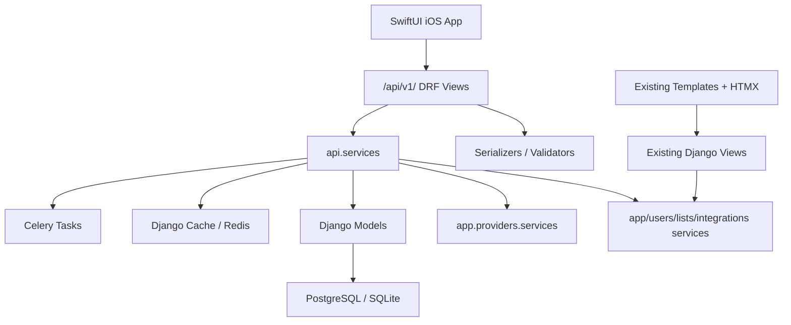

# Spine REST API v1 Implementation Plan

Status: implemented as an initial v1 API slice.

## Summary

Spine now exposes a Django REST Framework API at `/api/v1/` for native clients while preserving the existing Django template, HTMX, allauth session, Celery, import/export, and webhook routes.

The API is organized in a new `src/api/` app. Product-level social graph and feed models live in `src/social/`. Existing provider, tracking, diary, list, stats, and import code paths are reused through API service wrappers instead of replacing existing web views.

Core contracts:

- Mobile auth uses JWT access and refresh tokens.
- Media identity is the stable provider tuple: `source`, `media_type`, `media_id`, `season_number`, `episode_number`.
- Internal `Item.id` is returned only as `item_id` when a media item exists locally.
- Ratings remain 0-10 decimal values, serialized as strings.
- Dates and datetimes use ISO 8601.
- Provider keys are never exposed to clients.
- Media detail may expose typed optional `external_ratings`, `cast`, `crew`, `related_sections`, `episodes`, `seasons`, `custom_poster_url`, and `custom_backdrop_url` fields while preserving raw provider `details`, `related`, and `providers` during the transition.
- `community.rating_distribution` is Spine-only and is derived from public/followers diary ratings, never provider ratings.

## Architecture



Important files:

- `src/api/urls.py`
- `src/api/views/`
- `src/api/services/`
- `src/api/serializers/`
- `src/social/models.py`
- `src/config/settings.py`
- `src/config/urls.py`

## Endpoint Table

### Health and Meta

| Method | Path | Auth |
|---|---|---|
| GET | `/api/v1/health/` | No |
| GET | `/api/v1/meta/` | No |

### Auth and Current User

| Method | Path | Auth |
|---|---|---|
| POST | `/api/v1/auth/register/` | No |
| POST | `/api/v1/auth/login/` | No |
| POST | `/api/v1/auth/refresh/` | No |
| POST | `/api/v1/auth/logout/` | Yes |
| POST | `/api/v1/auth/password-reset/` | No |
| POST | `/api/v1/auth/password-reset/confirm/` | No |
| POST | `/api/v1/auth/apple/` | No, returns `501` placeholder |
| GET/PATCH | `/api/v1/me/` | Yes |
| POST/DELETE | `/api/v1/me/avatar/` | Yes |
| POST | `/api/v1/me/password/` | Yes |
| PATCH | `/api/v1/me/preferences/` | Yes |
| GET | `/api/v1/me/hof/` | Yes |
| PUT/DELETE | `/api/v1/me/hof/{media_type}/` | Yes |

### Media

| Method | Path | Auth |
|---|---|---|
| GET | `/api/v1/media/search/` | Yes |
| GET | `/api/v1/media/discover/` | Yes |
| GET | `/api/v1/media/sources/` | No |
| POST | `/api/v1/media/manual/` | Yes |
| GET | `/api/v1/media/{source}/{media_type}/{media_id}/` | Optional |
| GET | `/api/v1/media/{source}/{media_type}/{media_id}/community/` | No |
| GET | `/api/v1/media/{source}/{media_type}/{media_id}/reviews/` | Optional |
| GET | `/api/v1/media/{source}/{media_type}/{media_id}/posters/` | Yes |
| PUT | `/api/v1/media/{source}/{media_type}/{media_id}/poster/` | Yes |
| GET | `/api/v1/media/{source}/{media_type}/{media_id}/backdrops/` | Yes |
| PUT | `/api/v1/media/{source}/{media_type}/{media_id}/backdrop/` | Yes |
| GET | `/api/v1/media/{source}/tv/{media_id}/seasons/` | Optional |
| GET | `/api/v1/media/{source}/tv/{media_id}/seasons/{season_number}/` | Optional |
| GET | `/api/v1/media/{source}/tv/{media_id}/seasons/{season_number}/episodes/` | Optional |

### People

| Method | Path | Auth |
|---|---|---|
| GET | `/api/v1/people/tmdb/{person_id}/` | Optional |

### Tracking

| Method | Path | Auth |
|---|---|---|
| GET | `/api/v1/tracking/` | Yes |
| GET/PUT/PATCH/DELETE | `/api/v1/tracking/{source}/{media_type}/{media_id}/` | Yes |
| POST | `/api/v1/tracking/{source}/{media_type}/{media_id}/actions/{consume,pause,resume,drop}/` | Yes |
| POST | `/api/v1/tracking/{source}/tv/{media_id}/start/` | Yes |
| POST | `/api/v1/tracking/{source}/tv/{media_id}/seasons/{season_number}/start/` | Yes |
| POST/DELETE | `/api/v1/tracking/{source}/tv/{media_id}/seasons/{season_number}/watch/` | Yes |
| POST/DELETE | `/api/v1/tracking/{source}/tv/{media_id}/seasons/{season_number}/episodes/{episode_number}/watch/` | Yes |
| POST | `/api/v1/tracking/{source}/book/{media_id}/progress/` | Yes |
| POST | `/api/v1/tracking/{source}/book/{media_id}/complete/` | Yes |

`GET /api/v1/tracking/` requires `media_type` and returns the standard paged shape:
`count`, `next`, `previous`, `results`. Supported query params are `media_type`,
`status`, `ordering`/`sort`, `q`, `page`, and `page_size`. The endpoint paginates
the tracking queryset before serialization so page responses only serialize the
current page of rows.

### Diary, Lists, Profiles, Social

| Method | Path | Auth |
|---|---|---|
| GET/POST | `/api/v1/diary/` | Yes |
| GET/PATCH/DELETE | `/api/v1/diary/{id}/` | Yes |
| GET | `/api/v1/diary/tags/` | Yes |
| POST/DELETE | `/api/v1/diary/{id}/like/` | Yes |
| GET/POST | `/api/v1/lists/` | Yes |
| GET/PATCH/DELETE | `/api/v1/lists/{id}/` | Yes |
| GET/POST | `/api/v1/lists/{id}/items/` | Yes |
| PATCH | `/api/v1/lists/{id}/items/reorder/` | Yes |
| DELETE | `/api/v1/lists/{id}/items/{item_id}/` | Yes |
| GET/POST | `/api/v1/lists/{id}/people/` | Yes |
| PATCH | `/api/v1/lists/{id}/people/reorder/` | Yes |
| DELETE | `/api/v1/lists/{id}/people/{entry_id}/` | Yes |
| POST/DELETE | `/api/v1/lists/{id}/like/` | Yes |
| GET | `/api/v1/users/search/` | Yes |
| GET | `/api/v1/users/{username}/` | Optional |
| GET | `/api/v1/users/{username}/hof/` | Optional |
| GET | `/api/v1/users/{username}/activity/` | Optional |
| POST/DELETE | `/api/v1/users/{username}/follow/` | Yes |
| POST/DELETE | `/api/v1/users/{username}/block/` | Yes |
| GET | `/api/v1/feed/` | Yes |
| GET | `/api/v1/follow-requests/` | Yes |
| POST | `/api/v1/follow-requests/{id}/{accept,reject}/` | Yes |
| POST/DELETE | `/api/v1/social/likes/` | Yes |

`GET /api/v1/diary/` supports optional `tag=<tag>` filtering and returns the same paged diary-entry response shape. Native clients use this for tag detail pages, including diary-list and poster-grid views.

`POST /api/v1/diary/` supports diary entries for `movie`, `tv`, `season`,
`episode`, `anime`, `manga`, `game`, `book`, and `comic`. When
`auto_mark_consumed=true`, simple completed tracking rows are created or updated
for movie/game/anime/manga/book/comic. Episode logging only syncs an existing
episode tracking row; full TV cascade remains in the tracking endpoints.

`PATCH /api/v1/diary/{id}/` accepts a partial request body with any writable
diary field: `consumed_at`, `rating`, `review`, `review_title`, `tags`,
`visibility`, `contains_spoilers`, `is_rewatch`, and `liked`. The diary media
reference is not changed by PATCH. Editing `consumed_at` syncs the completion
date on existing completed tracking rows for the same item and re-queues daily
statistics.

`DELETE /api/v1/diary/{id}/` removes the diary entry and mirrors web tracking
side effects. If it was the last diary entry for a movie, TV show, season, or
diary-completed book, the corresponding tracking row is unwatched/untracked;
when other diary entries remain, tracking is retained.

`GET /api/v1/diary/tags/` returns `{ "results": [{ "name": "...", "usage_count": 1 }] }`. By default it is capped to 10 results for autocomplete. Passing `mine=true` limits counts to the authenticated user's diary tags. Passing `all=true` removes the autocomplete cap so native clients can render the full Profile Tags list, ordered by usage count descending and name ascending.

Custom lists are homogeneous and have an immutable `list_type` of `media` or
`people`. Omitting `list_type` when creating a list creates a `media` list,
which preserves the behavior of existing clients and all existing list rows.
To create a people list:

```json
{
  "name": "Favorite Directors",
  "list_type": "people",
  "visibility": "public",
  "is_ranked": true
}
```

`GET /api/v1/lists/` returns media lists by default. Pass
`list_type=people` for people lists or `list_type=all` for both types. The same
filter is supported by the featured-lists endpoint. A list's type cannot be
changed by `PATCH`; attempting to do so returns `400`.

All summary and detail payloads add `list_type` and `entries_count`.
`entries_count` is the number of entries of the list's declared type and
`people_count` is the people membership count. The
legacy `items_count`, `preview_items`, and `items` fields retain their media
semantics: for a people list they are `0`, `[]`, and `[]`. This makes the
change additive for older native clients. Summaries include `preview_people`
(capped at 12), and full details include `people`. The opposite-type array is
always present and empty when its surrounding response includes previews or
entries.

A people entry is a stored provider snapshot:

```json
{
  "entry_id": 73,
  "id": "525",
  "source": "tmdb",
  "name": "Christopher Nolan",
  "profile_url": "https://image.example/nolan.jpg",
  "known_for_department": "Directing",
  "position": 1,
  "date_added": "2026-07-28T04:10:00Z"
}
```

`entry_id` identifies the list membership and is used for deletion and
reordering. `id` is the provider's person ID and, together with `source`,
identifies the person. Supported person sources are `tmdb`, `hardcover`,
`openlibrary`, `musicbrainz`, `mal`, `mangaupdates`, and `anilist`.
`profile_url` and `known_for_department` may be null in API responses when the
provider does not supply them.

For add-to-list flows, `GET /api/v1/lists/` accepts optional media ref query
params: `ref[source]`, `ref[media_type]`, `ref[media_id]`, plus optional
`ref[season_number]` and `ref[episode_number]`. When present, each result
includes `has_item: true|false` and only media lists are returned.

The people equivalent accepts `person_ref[source]` and `person_ref[id]`.
Both are required; each returned people list includes
`has_person: true|false` and its nullable `person_entry_id`. A request must not
mix `ref` and `person_ref`.
Membership queries reject a conflicting explicit `list_type`.

Add a person with:

```http
POST /api/v1/lists/{id}/people/
Content-Type: application/json

{"ref": {"source": "tmdb", "id": "525"}}
```

The backend resolves the provider person once, validates that the person
exists, and persists the display snapshot. A newly created membership returns
`201` and `{ "created": true, "person": { ... } }`. Repeating the same
source/person ID is idempotent: it returns `200`, `created: false`, and the
existing entry without re-fetching or duplicating it. Provider `404` responses
become API `404`; other provider failures preserve the standard provider error
contract. Reads use the stored snapshot and do not depend on the provider being
available.

`GET /api/v1/lists/{id}/people/` returns the standard paged shape:
`count`, `next`, `previous`, and `results`. Private-list visibility and
owner/collaborator edit rules are identical to media lists.

Delete a people membership by its membership ID:

```http
DELETE /api/v1/lists/{id}/people/{entry_id}/
```

People endpoints reject media lists, and media item endpoints reject people
lists, with the typed list-mismatch error. This boundary prevents mixed-content
lists and protects existing media-list behavior.

`PATCH /api/v1/lists/{id}/` accepts `is_ranked`. Switching from normal to ranked
assigns contiguous positions in current entry order for either list type.
Switching back to normal preserves positions so imported or manually ranked
order is not lost. Ranked adds append with the next position; normal adds leave
`position` null. Ranked deletes renumber remaining entries.

`PATCH /api/v1/lists/{id}/items/reorder/` accepts:

```json
{ "item_ids": [42, 17, 99] }
```

`item_ids` must be exactly the full set of current list item IDs in desired
order. The endpoint writes positions `1..n` and returns the full list detail
payload.

People-list reordering uses membership IDs:

```http
PATCH /api/v1/lists/{id}/people/reorder/
Content-Type: application/json

{"entry_ids": [73, 51, 88]}
```

`entry_ids` must be exactly the full set of people membership IDs currently in
the list. The endpoint atomically writes positions `1..n`, touches the list's
`updated_at`, and returns the full list detail payload.

Adding a person emits the existing `list_item_added` social activity verb with
`media: null`. The activity object snapshot contains `list_name`,
`list_type: "people"`, and the stored `person` fields (`id`, `source`, `name`,
`profile_url`, and `known_for_department`). Feed serialization also exposes the
list name as `object.name`, preserving the fallback expected by older clients.

### Stats, Imports, Export

| Method | Path | Auth |
|---|---|---|
| GET | `/api/v1/stats/me/summary/` | Yes |
| GET | `/api/v1/users/{username}/stats/summary/` | Yes |
| GET | `/api/v1/imports/` | Yes |
| POST | `/api/v1/imports/{source}/` | Yes |
| GET | `/api/v1/imports/tasks/{task_id}/` | Yes |
| DELETE | `/api/v1/imports/schedules/{schedule_id}/` | Yes |
| GET | `/api/v1/exports/csv/` | Yes |

### Stats Summary

`GET /api/v1/stats/me/summary/` and
`GET /api/v1/users/{username}/stats/summary/` return the same additive native
stats contract. The existing `start_date`, `end_date`, `media_count`,
`media_type_distribution`, `score_distribution`, `status_distribution`,
and `top_rated` keys remain for older clients. Native clients should use
`range`, `overview`, `media_types`, and the typed arrays below.

Supported query parameters:

- Omit both dates for the inclusive range from one year ago through today.
- Pass ISO `start_date=YYYY-MM-DD` and `end_date=YYYY-MM-DD` for a custom
  inclusive range. An omitted boundary keeps its default.
- Pass `start_date=all&end_date=all` for all time. `all` must be supplied for
  both boundaries.
- Invalid dates and reversed ranges return `400` field errors.

The selected range scopes diary-backed consumption data: activity, ratings,
reviews, repeats, top-rated/most-logged media, release years, genres, and
languages. `tracked_count`, status counts, `completed_count`, and
`liked_count` describe the user's current all-time library snapshot.
Season- and episode-level diary entries roll up into the `tv` media bucket.
The stable primary media buckets are `movie`, `tv`, `anime`, `manga`, `game`,
`book`, and `comic`, including zero-valued buckets.

```json
{
  "schema_version": 1,
  "range": {
    "start_date": "2026-01-01",
    "end_date": "2026-12-31",
    "timezone": "America/Los_Angeles",
    "is_all_time": false
  },
  "overview": {
    "tracked_count": 760,
    "completed_count": 496,
    "diary_entry_count": 812,
    "unique_logged_count": 760,
    "repeat_count": 52,
    "rated_count": 523,
    "average_rating": "7.6",
    "review_count": 110,
    "liked_count": 86,
    "active_days": 421,
    "current_streak_days": 4,
    "longest_streak_days": 28
  },
  "media_types": [
    {
      "media_type": "movie",
      "tracked_count": 120,
      "completed_count": 95,
      "diary_entry_count": 135,
      "unique_logged_count": 120,
      "repeat_count": 15,
      "rated_count": 110,
      "average_rating": "7.8",
      "review_count": 40,
      "liked_count": 20,
      "statuses": {
        "completed": 95,
        "in_progress": 2,
        "planning": 18,
        "paused": 3,
        "dropped": 2
      },
      "rating_distribution": [
        { "rating": "0.0", "count": 0 },
        { "rating": "0.5", "count": 1 }
      ],
      "top_rated": [
        { "media": { "ref": { "item_id": 42 } }, "rating": "10.0" }
      ],
      "most_logged": [
        { "media": { "ref": { "item_id": 42 } }, "log_count": 5 }
      ],
      "release_years": [{ "year": 1999, "count": 12 }],
      "top_genres": [{ "name": "Drama", "count": 44 }],
      "top_languages": [{ "name": "English", "count": 95 }],
      "metadata_coverage": {
        "total_items": 120,
        "release_year_items": 118,
        "genre_items": 115,
        "language_items": 101
      }
    }
  ],
  "activity": {
    "days": [{ "date": "2026-07-14", "count": 2 }],
    "months": [{ "month": "2026-07", "count": 18 }],
    "active_days": 421,
    "current_streak_days": 4,
    "longest_streak_days": 28,
    "most_active_weekday": {
      "weekday": 1,
      "name": "Tuesday",
      "active_day_count": 72,
      "percentage": 17.1
    }
  },
  "rating_distribution": [{ "rating": "8.5", "count": 14 }],
  "diary_top_rated": [
    { "media": { "ref": { "item_id": 42 } }, "rating": "10.0" }
  ],
  "most_logged": [
    { "media": { "ref": { "item_id": 42 } }, "log_count": 5 }
  ],
  "release_years": [{ "year": 1999, "count": 42 }],
  "top_genres": [{ "name": "Drama", "count": 80 }],
  "top_languages": [{ "name": "English", "count": 95 }],
  "metadata_coverage": {
    "total_items": 760,
    "release_year_items": 735,
    "genre_items": 700,
    "language_items": 645
  }
}
```

Contract details:

- `rating_distribution` always contains all 21 half-point buckets from `0.0`
  through `10.0`; decimal values are strings.
- `release_years` is sparse and sorted ascending. Genre and language arrays are
  capped at ten values, ordered by count descending and then name.
- Top-level media arrays are capped at 12 entries. Each media-type entry is
  self-contained and caps `top_rated` and `most_logged` at six entries.
- `diary_top_rated` is the native visibility-aware ranked array. The legacy
  top-level `top_rated` key remains tracking-score based for the current user;
  other-user responses project visible diary ratings into legacy
  `score_distribution` and `top_rated` so private activity cannot leak.
- `activity.days` contains active days only; clients may fill zero days for a
  calendar presentation. `months` uses `YYYY-MM`. Weekdays use `0` for Monday
  through `6` for Sunday. `most_active_weekday` is `null` when there is no
  activity.
- Genre, language, and release-year statistics use only locally indexed
  `Item`/`ItemFilterFacet` data and never trigger provider requests. The
  coverage object makes incomplete metadata explicit.
- For another user's stats, account privacy, accepted follows, and blocks are
  enforced. Public entries are always eligible, followers-only entries require
  an accepted follow, and private entries are never included. Embedded media
  summaries deliberately return `user_state: null` so a target user's private
  tracking, diary, and list state is not exposed.

## Auth Flow

1. iOS calls `/api/v1/auth/login/` or `/api/v1/auth/register/`.
2. Store `refresh` in Keychain.
3. Send `Authorization: Bearer <access>` on authenticated requests.
4. Refresh through `/api/v1/auth/refresh/`.
5. Logout through `/api/v1/auth/logout/`, which blacklists the refresh token.

## Current User Settings

`GET /api/v1/me/` returns the current `profile_payload()`, including profile fields, avatar URL, social counts, Hall of Fame map, and `preferences`.

`PATCH /api/v1/me/` accepts any subset of:

```json
{
  "username": "mika",
  "display_name": "Mika",
  "bio": "Tracking films, books, and games.",
  "pronouns": "they/them",
  "location": "Portland",
  "is_private": false
}
```

Validation matches the web account form where relevant: usernames use Django's Unicode username rules, must be unique, and demo users cannot change them. `bio` is capped at 500 characters, `pronouns` at 50, and `location` at 100. Successful updates return the full profile payload. `is_private` writes `users.User.profile_private`; visibility changes are audit-logged.

Errors use DRF field errors:

```json
{ "username": ["A user with that username already exists."] }
```

`POST /api/v1/me/avatar/` accepts multipart form-data with a required `avatar` file field. Allowed content types are `image/jpeg`, `image/png`, and `image/webp`; max size is 5 MB. Replacing an avatar deletes the previous profile picture file when possible.

```json
{ "avatar_url": "https://example.com/media/profile_pictures/avatar.png" }
```

`DELETE /api/v1/me/avatar/` clears the current profile picture, deletes the stored file when possible, and returns:

```json
{ "avatar_url": null }
```

`PATCH /api/v1/me/preferences/` accepts any subset of:

```json
{
  "enabled_media_types": ["movie", "tv", "book"],
  "date_format": "Y-m-d",
  "time_format": "H:i",
  "week_start_day": "monday",
  "quick_watch_date": "current_date",
  "release_notifications_enabled": true,
  "daily_digest_enabled": true
}
```

`enabled_media_types` must contain at least one supported `app.models.MediaTypes` value, excluding `episode`. Date, time, week-start, and quick-watch values must match the choice classes in `users.models`. Demo users cannot update preferences. Successful updates return `preferences_payload(user)`, not the full profile.

`POST /api/v1/me/password/` changes the current user's password:

```json
{
  "old_password": "current-password",
  "new_password": "new-password",
  "new_password_confirm": "new-password"
}
```

Validation uses the web password-change form, including password validators and the demo-user block. Success returns:

```json
{ "detail": "Password updated." }
```

`GET /api/v1/meta/` includes picker choices for mobile settings:

```json
{
  "date_formats": [{ "value": "Y-m-d", "label": "2026-01-18 (ISO)" }],
  "time_formats": [{ "value": "H:i", "label": "14:30 (24-hour)" }],
  "week_start_days": [{ "value": "monday", "label": "Monday" }],
  "quick_watch_dates": [{ "value": "current_date", "label": "Current Date" }]
}
```

## Current User Hall of Fame

`GET /api/v1/me/hof/` returns the current user's Hall of Fame map:

```json
{
  "items": {
    "movie": {
      "ref": {
        "item_id": 42,
        "source": "tmdb",
        "media_type": "movie",
        "media_id": "550",
        "season_number": null,
        "episode_number": null
      },
      "title": "Fight Club",
      "subtitle": null,
      "overview": null,
      "image_url": "https://example.com/fight-club.jpg",
      "poster_url": "https://example.com/fight-club.jpg",
      "backdrop_url": null,
      "poster_aspect_ratio": null,
      "poster_width": null,
      "poster_height": null,
      "poster_orientation": "unknown",
      "poster_accent_color": null,
      "release_date": null,
      "default_source": "tmdb",
      "custom_poster_url": null,
      "user_state": null
    },
    "tv": null,
    "anime": null,
    "manga": null,
    "game": null,
    "book": null,
    "comic": null
  }
}
```

`PUT /api/v1/me/hof/{media_type}/` sets one slot. Supported `media_type` values are `movie`, `tv`, `anime`, `manga`, `game`, `book`, and `comic`. The URL media type must match `ref.media_type`.

The request body uses the same media ref shape returned by `/api/v1/media/search/`; `item_id` may be `null` when the item has not been materialized locally yet:

```json
{
  "ref": {
    "item_id": null,
    "source": "tmdb",
    "media_type": "movie",
    "media_id": "550",
    "season_number": null,
    "episode_number": null
  }
}
```

`PUT` and `DELETE /api/v1/me/hof/{media_type}/` both return the updated map in the same `{"items": ...}` shape as `GET`.

## Media Reviews

`GET /api/v1/media/{source}/{media_type}/{media_id}/reviews/` returns public community diary reviews for a media identity. Query params: optional `season_number`, optional `episode_number`, and `sort=recent|popular` with `popular` as the mobile default.

Response shape is a paged list of review cards:

```json
{
  "count": 1,
  "next": null,
  "previous": null,
  "results": [
    {
      "id": 701,
      "user": { "id": 7, "username": "mika", "display_name": "Mika", "avatar_url": null },
      "rating": "9.0",
      "review_title": "A pulse under glass",
      "review": "Cold surface, hot center.",
      "contains_spoilers": false,
      "like_count": 42,
      "viewer_has_liked": false,
      "consumed_at": "2026-06-19T20:30:00Z",
      "created_at": "2026-06-20T02:11:00Z"
    }
  ]
}
```

Likes use the existing diary like endpoints: `POST /api/v1/diary/{id}/like/` and `DELETE /api/v1/diary/{id}/like/`, returning `{ "liked": true, "like_count": 43 }`.

## Media Poster Customization

Poster customization is available for authenticated users on TMDB movies and TV shows only.

`GET /api/v1/media/{source}/{media_type}/{media_id}/posters/` returns the current item poster first, followed by TMDB poster images sorted by `vote_average` and then `vote_count`, both descending:

```json
{
  "posters": [
    {
      "url": "https://image.tmdb.org/t/p/original/poster.jpg",
      "thumbnail_url": "https://image.tmdb.org/t/p/w342/poster.jpg",
      "width": 2000,
      "height": 3000,
      "aspect_ratio": 0.667,
      "vote_average": 8.0,
      "vote_count": 12,
      "language": "en",
      "is_original": false,
      "is_selected": true
    }
  ]
}
```

`PUT /api/v1/media/{source}/{media_type}/{media_id}/poster/` accepts `{ "poster_url": "https://..." }`, saves the viewer's poster preference, updates the stored item poster/accent, and returns:

```json
{
  "poster_url": "https://image.tmdb.org/t/p/original/poster.jpg",
  "custom_poster_url": "https://image.tmdb.org/t/p/original/poster.jpg",
  "poster_accent_color": "#123456"
}
```

## Media Backdrop Customization

Backdrop customization is available for authenticated users on TMDB movies and TV shows only.

`GET /api/v1/media/{source}/{media_type}/{media_id}/backdrops/` returns the default TMDB backdrop first, followed by TMDB backdrop images sorted by `vote_average` and then `vote_count`, both descending:

```json
{
  "backdrops": [
    {
      "url": "https://image.tmdb.org/t/p/original/backdrop.jpg",
      "thumbnail_url": "https://image.tmdb.org/t/p/w780/backdrop.jpg",
      "width": 1920,
      "height": 1080,
      "aspect_ratio": 1.778,
      "vote_average": 8.0,
      "vote_count": 12,
      "language": "en",
      "is_original": false,
      "is_selected": true
    }
  ]
}
```

`PUT /api/v1/media/{source}/{media_type}/{media_id}/backdrop/` accepts `{ "backdrop_url": "https://..." }`, saves the viewer's backdrop preference, does not mutate the stored item poster/accent, and returns:

```json
{
  "backdrop_url": "https://image.tmdb.org/t/p/original/backdrop.jpg",
  "custom_backdrop_url": "https://image.tmdb.org/t/p/original/backdrop.jpg"
}
```

## Media Discovery

`GET /api/v1/media/discover/` returns a standard paged `MediaSummary` response for provider-backed browse lists. It is authenticated and uses the same provider throttle as media search/detail.

Required query params:

- `media_type`: `movie`, `tv`, `game`, or `book`.

At least one browse filter is required:

- `genre`: display name, resolved to provider genre IDs.
- `year`: 4-digit release year.
- `platform`: display name, games only.

Optional query params:

- `source`: defaults to the configured source for the media type.
- `page`, `page_size`: page-number pagination. TMDB discover uses TMDB's native 20-item pages; IGDB and book providers honor `page_size` up to the standard API max.
- `sort`: `vote_count` by default. V1 maps this to TMDB `vote_count.desc` for movies/TV, IGDB `total_rating_count desc` for games, Hardcover `ratings_count desc`, and Open Library `ratings_count desc`.

Supported matrix:

| Media type | Source | Filters | Sort |
|---|---|---|---|
| `movie` | `tmdb` | `genre`, `year` | `vote_count` |
| `tv` | `tmdb` | `genre`, `year` | `vote_count`; TV genre aliases such as `Fantasy`, `Science Fiction`, and `Sci-Fi` resolve to TMDB TV genres when exact names differ |
| `game` | `igdb` | `genre`, `year`, `platform` | `vote_count` |
| `book` | `hardcover` | `genre`, `year` | `ratings_count` |
| `book` | `openlibrary` | `genre`, `year` | `ratings_count` |

Unsupported media types/sources return `501` with a clear `detail`. Invalid params return DRF field errors with `400`. Anime, manga, and comic discovery are intentionally out of scope for v1.

## People Detail

`GET /api/v1/people/tmdb/{person_id}/` returns a TMDB person profile for native person pages. V1 supports TMDB people only and returns `501` for other sources. Filmography items are mixed movie/TV cast and crew credits, de-duplicated by the provider and returned as standard `MediaSummary` objects sorted by TMDB popularity descending.

```json
{
  "id": "819",
  "source": "tmdb",
  "name": "Edward Norton",
  "biography": "An actor biography.",
  "profile_url": "https://image.tmdb.org/t/p/w500/profile.jpg",
  "known_for_department": "Acting",
  "birth_date": "1969-08-18",
  "death_date": null,
  "place_of_birth": "Boston, Massachusetts, USA",
  "popularity": 42.7,
  "credits": {
    "cast": [
      {
        "ref": { "item_id": null, "source": "tmdb", "media_type": "movie", "media_id": "550", "season_number": null, "episode_number": null },
        "title": "Fight Club",
        "subtitle": "1999",
        "overview": null,
        "image_url": "https://example.com/fight-club.jpg",
        "poster_url": "https://example.com/fight-club.jpg",
        "backdrop_url": null,
        "poster_accent_color": null,
        "release_date": null,
        "default_source": "tmdb",
        "custom_poster_url": null,
        "user_state": null
      }
    ]
  }
}
```

## Media Detail

`GET /api/v1/media/{source}/{media_type}/{media_id}/` returns raw provider fields plus normalized native-client fields:

```json
{
  "ref": {
    "item_id": null,
    "source": "tmdb",
    "media_type": "movie",
    "media_id": "550",
    "season_number": null,
    "episode_number": null
  },
  "title": "Fight Club",
  "subtitle": "1999",
  "overview": "Soap, clubs, and insomnia.",
  "synopsis": "Soap, clubs, and insomnia.",
  "image_url": "https://example.com/fight-club.jpg",
  "poster_accent_color": null,
  "release_date": "1999-10-15",
  "default_source": "tmdb",
  "user_state": null,
  "backdrop_url": "https://image.tmdb.org/t/p/original/backdrop.jpg",
  "custom_backdrop_url": null,
  "custom_poster_url": null,
  "details": {
    "runtime": "2h 19m",
    "rating": "R",
    "genres": ["Drama", "Thriller"],
    "revenue": 100853753
  },
  "cast": [
    {
      "id": "819",
      "name": "Edward Norton",
      "role": null,
      "character": "Narrator",
      "image_url": "https://example.com/edward.jpg"
    }
  ],
  "crew": [
    {
      "id": "7467",
      "name": "David Fincher",
      "role": "Director",
      "character": null,
      "image_url": null
    }
  ],
  "seasons": [],
  "episodes": [],
  "providers": {
    "US": {
      "flatrate": [
        { "provider_id": 8, "provider_name": "Netflix", "logo_path": "/logo.png" }
      ]
    }
  },
  "related": {
    "recommendations": []
  },
  "related_sections": [
    {
      "id": "recommendations",
      "title": "Recommendations",
      "items": [
        {
          "ref": { "item_id": null, "source": "tmdb", "media_type": "movie", "media_id": "680", "season_number": null, "episode_number": null },
          "title": "Pulp Fiction",
          "subtitle": null,
          "overview": null,
          "image_url": "https://example.com/pulp.jpg",
          "poster_accent_color": null,
          "release_date": null,
          "default_source": "tmdb",
          "user_state": null
        }
      ]
    }
  ],
  "external_ratings": [
    { "source": "TMDB", "value": "8.4", "vote_count": 1000, "max_value": "10", "url": "https://www.themoviedb.org/movie/550" },
    { "source": "IMDb", "value": "8.8", "vote_count": 2300000, "max_value": "10", "url": "https://www.imdb.com/title/tt0137523/" },
    { "source": "Rotten Tomatoes", "value": "79%", "vote_count": 100, "max_value": "100%" }
  ],
  "community": {
    "average_rating": "8.0",
    "rating_count": 2,
    "diary_count": 3,
    "review_count": 1,
    "liked_count": 0,
    "rating_distribution": [
      { "rating": "8.0", "count": 2 }
    ]
  }
}
```

Rules:

- Each `external_ratings` entry may include an optional absolute HTTP(S) `url` for the exact media page on that rating provider. Native clients should make the rating pill actionable only when this field is present and valid; entries without `url` remain display-only. Representative provider URLs include `https://letterboxd.com/film/fight-club/`, `https://hardcover.app/books/the-great-gatsby`, and `https://openlibrary.org/books/OL7353617M`. Provider API URLs, credentials, and generic search-result pages must not be returned.
- Books expose `other_editions` and recommendations when providers return them.
- Games expose typed sections such as `dlcs`, `expansions`, and canonical `all_related`.
- Anime and manga expose MAL/MangaUpdates related sections such as `related_anime`, `related_manga`, and recommendations.
- TV seasons are top-level `seasons`, not `related_sections`.
- Season detail exposes top-level `episodes` with `runtime` strings.
- `rating_distribution` uses only actual Spine diary ratings visible outside private scope and returns `[]` when there are no ratings.

## New Models and Migrations

- `users.User.display_name`
- `users.User.profile_private` default changed to public for new users
- `app.DiaryEntry.visibility`
- `app.DiaryEntry.contains_spoilers`
- `app.DiaryEntry.review_title`
- `app.DiaryEntry.updated_at`
- `lists.CustomList.visibility`
- `lists.CustomList.slug`
- `lists.CustomList.updated_at`
- `social.Follow`
- `social.Block`
- `social.ContentLike`
- `social.Activity`
- `social.SocialAuditLog`

Existing diary entries and lists migrate conservatively with private visibility. New diary entries default to public at the model/API layer.

## Example Payloads

### Login

```json
{
  "access": "jwt-access",
  "refresh": "jwt-refresh",
  "user": {
    "id": 1,
    "username": "armaan",
    "display_name": "armaan",
    "is_private": false
  }
}
```

### Media Search Result

```json
{
  "count": 1,
  "next": null,
  "previous": null,
  "results": [
    {
      "ref": {
        "item_id": null,
        "source": "tmdb",
        "media_type": "movie",
        "media_id": "550",
        "season_number": null,
        "episode_number": null
      },
      "title": "Fight Club",
      "subtitle": "1999",
      "image_url": "https://example.com/fight-club.jpg",
      "user_state": null
    }
  ]
}
```

## Validation

Commands run:

```bash
venv/bin/python src/manage.py check
venv/bin/python src/manage.py makemigrations --check --dry-run
venv/bin/python src/manage.py test api --verbosity 2
venv/bin/ruff check src/api src/social
```

Note: `ruff check src` still reports unrelated pre-existing lint issues outside the new API/social implementation.

## Follow-Up Work

- Harden full provider metadata normalization after iOS starts consuming real endpoints.
- Implement Sign in with Apple.
- Expand API tests for tracking, diary, lists, feed privacy, imports, and social actions.
- Decide whether old diary/list data should ever be migrated from private to public.
- Add iOS fixture JSON generated from live API responses.

Ready for implementation: YES
