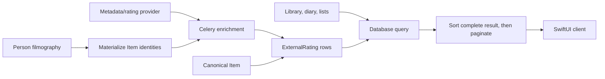

# Provider-Agnostic External Ratings: Ten-Phase Implementation Plan

Status: **proposed implementation plan**

Last reviewed against the repository: **2026-07-20**

This document is the source of truth for replacing Spine's fixed external-rating
sort fields with a provider-agnostic rating cache that works across media types,
library pages, item-backed collections, and provider-backed filmographies.

Each phase below contains a standalone prompt. Open a fresh Codex task, switch it
to Plan mode, copy the complete prompt for that phase, and approve the plan only
after it accounts for the current branch. Complete phases in order. Each phase
must leave the repository buildable and testable; do not combine phases unless
the owner explicitly requests it.

## Outcome

External-rating sorts must be fast because they read Spine's database, not
because the iOS client downloads and sorts every record. The final flow is:



## Locked decisions

These decisions were pressure-tested against the existing code and are not open
for reinvention inside individual phases.

| Concern | Decision |
| --- | --- |
| Ownership | External ratings belong to the global `Item`, never to a user tracking row. |
| Local storage | Ratings live in the backend database (SQLite locally, PostgreSQL in production), not on the iPhone. |
| Known media | A media object is known when it has an `Item` row. The project does not ingest an entire upstream provider universe. |
| Identity | Use the existing exact `Item` identity, including source, media type, media ID, season number, and episode number. Do not introduce cross-provider deduplication. |
| Schema | Add one generic `ExternalRating` model related to `Item`; do not add another rating column per provider. |
| Provider keys | Rating-source keys are stable lowercase strings such as `imdb`, `letterboxd`, `hardcover`, `igdb`, or a future `goodreads`. They are not constrained by `app.models.Sources`, because a rating source need not be the item's metadata source. |
| Scale | Store the raw provider value and maximum scale. Sort one provider independently; do not normalize or compare IMDb, Letterboxd, IGDB, and Goodreads against one another. |
| Missing values | Unsupported, unavailable, and missing ratings remain in the collection and sort last. Stable ties use case-insensitive title and then item identity. Missing is not zero. |
| Fetching | Collection reads never make upstream requests. New and stale ratings are enriched asynchronously through Celery. |
| Backfill | Backfill every existing eligible `Item`, in resumable batches. Adding a provider later requires its adapter plus one provider-specific backfill. |
| Failure behavior | Never erase a previously successful value because a refresh failed. Record the failed attempt and keep serving the last successful value. |
| Sort location | Django orders the complete filtered queryset before pagination. SwiftUI renders server order and never re-sorts only loaded pages. |
| API sort key | Use a dynamic canonical token such as `rating:<rating_source>`. Continue accepting existing `letterboxd_rating`, `imdb_rating`, and `rotten_tomatoes_rating` aliases during migration. |
| Client options | The backend advertises applicable rating sorts. The iOS client treats sort values as opaque strings instead of requiring a new enum case for every provider. |
| Person pages | Provider credits are materialized as basic `Item` rows without tracking them. Missing ratings are queued in bulk. The API reports preparation state; the first uncached external sort may prepare, while later sorts are immediate. |
| Existing fields | Keep the three legacy `Item` rating columns through this plan. Do not use a destructive migration to remove them. |
| Goodreads example | The architecture must support Goodreads, but no phase may scrape it or assume an API/license. A real Goodreads adapter requires an approved, reliable data source. |

## Definition of complete

The project is complete when all of the following are true:

- Every supported rating source is represented by a small registry entry and a
  fetcher that can return available, unavailable, or failed outcomes.
- Every existing eligible `Item` can be backfilled idempotently, with progress
  inferred from per-item rating state and safe reruns.
- New items enqueue enrichment after their database transaction commits.
- Stale data refreshes in the background without blocking collection requests.
- Tracking/library, diary, and custom-list endpoints sort the full filtered
  queryset by any advertised rating source before pagination.
- The iOS Library sends and preserves dynamic sort values through every page.
- Person filmographies can prepare and then sort all returned credits by an
  applicable external rating without one upstream call per credit in the HTTP
  request.
- Automated tests make no live provider calls.
- SQLite and PostgreSQL-compatible migrations remain non-destructive.
- Existing media-detail external-rating response shapes remain compatible.

---

## Phase 1 — Generic rating data contract and schema

### Copy/paste prompt

```text
Implement Phase 1 of Spine's provider-agnostic external-rating plan. Work in
Plan mode first and do not implement until the plan is approved.

Repository: /Users/armaandave/projects/spine
Read AGENTS.md and docs/external-ratings-implementation-plan.md before planning.
Inspect the current Item model, migrations, API external-rating payloads, and
tests. Preserve unrelated worktree changes.

Goal:
Create the durable backend data contract for external ratings without changing
runtime sorting, provider fetching, API behavior, or iOS behavior yet.

Required design:
- Add one Django model named ExternalRating related to app.models.Item.
- Use a free-form stable rating_source string; do not add rating providers to
  app.models.Sources solely for this feature.
- Store nullable raw value, maximum value, vote count, canonical URL, outcome
  status, last-attempt timestamp, last-success timestamp, and a bounded last
  error message suitable for operations. Use Decimal fields for value/maximum.
- Define statuses that distinguish at least available, unavailable, and failed.
  A row with a prior available value must be allowed to retain that value when a
  later refresh attempt fails; model validation must not force data loss.
- Add a uniqueness constraint on (item, rating_source).
- Add only indexes justified by the future access patterns: exact item/source
  lookup, source/value ordering, and source/status/freshness scanning.
- Add database/model constraints for non-negative values, positive maximums,
  and valid available rows where practical on both SQLite and PostgreSQL.
- Use related_name="external_ratings" unless current code reveals a collision.
- Add the forward migration. Do not edit old migrations and do not remove the
  existing Item letterboxd_rating, imdb_rating, or rotten_tomatoes_rating fields.
- Add focused model tests for uniqueness, valid available/unavailable rows,
  exact episode identity, and preservation of a successful value across a
  recorded failed attempt.
- Add minimal Django admin visibility if it is consistent with current app
  model administration; do not build an operations dashboard.

Explicit non-goals:
- No provider registry or network calls.
- No data migration from legacy fields.
- No Celery tasks, sorting changes, API changes, or Swift changes.
- No generic plugin framework, factory hierarchy, or speculative provider SDK.

Verification:
- Generate and inspect the new migration.
- Run the focused app model tests.
- Run python manage.py makemigrations --check --dry-run.
- Run ruff check src for touched Python code.

Handoff requirements:
Report the exact schema, constraints, indexes, migration impact, tests run, and
any concern that a later phase must handle. Leave Phase 2 unimplemented.
```

### Exit gate

- `ExternalRating` exists with a non-destructive migration.
- No production behavior changed.
- The old fixed fields remain intact.

---

## Phase 2 — Rating-source registry and shared persistence service

### Copy/paste prompt

```text
Implement Phase 2 of Spine's provider-agnostic external-rating plan. Work in
Plan mode first and do not implement until the plan is approved.

Repository: /Users/armaandave/projects/spine
Read AGENTS.md and docs/external-ratings-implementation-plan.md. Confirm Phase 1
and its ExternalRating migration are present. Inspect app.providers.services,
api.services.media.external_ratings, api.services.filters, MDBList, IMDb,
TMDB metadata external_ratings, IGDB/Steam Metacritic, Hardcover, OpenLibrary,
MAL, MangaUpdates, ComicVine, and MusicBrainz behavior. Preserve unrelated work.

Goal:
Create one shared, provider-agnostic rating registry and persistence/enrichment
service that existing API code and later Celery tasks can call.

Required design:
- Put the shared domain service under app/, not api/, so Celery, web, and API
  callers can reuse it without reversing dependencies.
- Use a simple registry/dictionary of rating-source definitions. Do not create a
  class hierarchy or factory framework.
- Each definition must expose a stable key, display label, applicable media
  types/item sources, raw maximum scale, freshness policy, and fetch operation.
- Permit one upstream operation to emit multiple rating sources. In particular,
  one MDBList response must populate IMDb, Letterboxd, and Rotten Tomatoes
  rather than calling MDBList three times.
- Reuse current provider metadata and current provider helpers. Do not duplicate
  HTTP clients or bypass existing caches/rate-limit behavior.
- Normalize fetch results into available, unavailable, or failed outcomes and
  upsert ExternalRating rows atomically.
- On refresh failure, preserve any last successful value and update attempt/error
  metadata. On authoritative no-rating responses, store unavailable with a null
  value. Do not endlessly reinterpret unavailable as an exception.
- Centralize source labels and max scales now duplicated in API media code while
  preserving current media-detail response labels and scales.
- Include the native provider score when metadata supplies one, using the item's
  provider key (for example IGDB, Hardcover, OpenLibrary, MAL, MangaUpdates,
  TMDB, or MusicBrainz when legally/enabled). Include existing third-party paths
  such as MDBList and Metacritic only where current provider identity supports
  them.
- Manual items and unsupported provider/media combinations must be skipped
  cleanly, not marked failed.
- Keep the registry extensible so a future approved Goodreads fetcher is one
  definition/fetch operation, not a schema or sorting rewrite.
- Add deterministic unit tests with mocks/fixtures. Tests must prove grouped
  MDBList fetching, exact season/episode matching, unavailable outcomes,
  successful upserts, and preservation on refresh failure.

Explicit non-goals:
- No Celery tasks or automatic enqueueing.
- No backfill command.
- No collection sorting or iOS changes.
- Do not implement Goodreads without an approved source and policy.

Verification:
- Run focused provider/service tests without live network access.
- Run existing API external-rating tests to prove response helpers remain viable.
- Run ruff check src.

Handoff requirements:
Document every registered rating source, its eligible media types/sources, its
scale, its upstream call grouping, and its freshness policy. Identify sources
that correctly remain unsupported. Leave Phase 3 unimplemented.
```

### Exit gate

- A single service can fetch and persist ratings for any supported `Item`.
- Adding a provider no longer requires a schema change.
- No background execution or sorting has changed yet.

---

## Phase 3 — Migrate existing values and unify media-detail reads/writes

### Copy/paste prompt

```text
Implement Phase 3 of Spine's provider-agnostic external-rating plan. Work in
Plan mode first and do not implement until the plan is approved.

Repository: /Users/armaandave/projects/spine
Read AGENTS.md and docs/external-ratings-implementation-plan.md. Confirm Phases
1-2 are complete. Inspect Item's three legacy rating fields,
api.services.filters.update_item_external_ratings,
api.services.media.external_ratings, media detail serializers, and their tests.
Preserve unrelated worktree changes.

Goal:
Move persisted external-rating ownership to ExternalRating while keeping media
detail output and old clients compatible.

Required work:
- Add a non-destructive data migration that copies every non-null legacy Item
  rating into ExternalRating:
  - letterboxd_rating -> source letterboxd, max 5
  - imdb_rating -> source imdb, max 10
  - rotten_tomatoes_rating -> source tomatoes, max 100
- Use filter_metadata_updated_at as the historical success/attempt timestamp when
  available; otherwise use a deterministic migration-time fallback.
- Make the migration idempotent in effect and safe if an ExternalRating row was
  already created by newer code during a rolling deployment.
- Route all current rating persistence from media-detail/provider normalization
  through the shared Phase 2 service.
- Build media-detail external_ratings from provider-native values plus stored
  generic rows without duplicate source entries. Preserve the current JSON
  shape: source, value, vote_count, max_value, and url.
- Maintain legacy aliases/columns during transition. If dual-writing them is
  necessary for unchanged paths, keep dual-write logic in one compatibility
  helper; do not scatter it among providers.
- Do not erase existing successful generic rows when detail lookup fails.
- Preserve exact season and episode matching.
- Add migration tests and API contract tests covering movie, episode, book, game,
  and at least one unsupported/manual item.

Explicit non-goals:
- No destructive removal of legacy columns.
- No Celery, auto-refresh, backfill network fetch, sorting, or iOS changes.
- Do not change community or user ratings; this phase concerns external provider
  ratings only.

Verification:
- Run migration tests in both forward and already-populated scenarios.
- Run targeted API media-detail/provider tests.
- Run makemigrations --check --dry-run and ruff check src.

Handoff requirements:
Report migrated row counts in test fixtures, compatibility behavior, remaining
legacy field readers/writers, and any source that still lacks a persisted path.
Leave Phase 4 unimplemented.
```

### Exit gate

- Existing stored values exist in the generic table.
- Media detail has no separate external-rating persistence implementation.
- Wire responses remain compatible.

---

## Phase 4 — Celery enrichment tasks

### Copy/paste prompt

```text
Implement Phase 4 of Spine's provider-agnostic external-rating plan. Work in
Plan mode first and do not implement until the plan is approved.

Repository: /Users/armaandave/projects/spine
Read AGENTS.md and docs/external-ratings-implementation-plan.md. Confirm Phases
1-3 are complete. Inspect src/app/tasks.py, config/celery.py, Celery settings,
provider error types, cache use, and existing task test patterns. Preserve
unrelated worktree changes.

Goal:
Expose the shared enrichment service through small, idempotent Celery tasks that
can handle one new item and efficient batches without blocking HTTP requests.

Required work:
- Add an item enrichment task accepting item_id, optional rating sources, and a
  force flag. The task must reload the Item by ID and skip deleted, manual, or
  unsupported items safely.
- Add a batch task accepting explicit item IDs and optional rating sources. It
  may loop through the bounded batch and call the same one-item service; do not
  create a workflow framework.
- Make tasks idempotent. Fresh successful/unavailable rows should be skipped
  unless force is true.
- Respect per-source freshness and existing provider caches/rate limits.
- Use bounded retry/backoff only for transient provider/network failures. An
  authoritative no-rating result is not retried as an exception.
- Catch failures per item/source so one bad media record does not abort an entire
  backfill batch.
- Prevent duplicate expensive work with the simplest existing cache primitive
  that works across workers. Do not introduce a new lock dependency.
- Keep task arguments serializable IDs/strings; do not pass model instances.
- Return/log compact counts useful to operations without logging secrets or full
  provider payloads.
- Add Celery task tests with eager/mocked execution for fresh skips, forced
  refresh, deleted items, transient failure, unavailable rating, and mixed batch
  outcomes. No live provider calls.

Explicit non-goals:
- Do not yet wire Item creation signals or periodic schedules.
- Do not implement a management backfill command.
- Do not change API sorting or iOS.

Verification:
- Run focused task/service tests.
- Confirm task discovery names are stable and no existing Celery task changes.
- Run ruff check src.

Handoff requirements:
Report task names/signatures, retry behavior, deduplication behavior, batch size
assumptions, and tests. Leave Phase 5 unimplemented.
```

### Exit gate

- One item or a bounded item batch can be enriched safely in the background.
- Tasks are retryable and idempotent.
- No HTTP read path invokes them yet.

---

## Phase 5 — Automatic enrichment and freshness maintenance

### Copy/paste prompt

```text
Implement Phase 5 of Spine's provider-agnostic external-rating plan. Work in
Plan mode first and do not implement until the plan is approved.

Repository: /Users/armaandave/projects/spine
Read AGENTS.md and docs/external-ratings-implementation-plan.md. Confirm Phases
1-4 are complete. Inspect every Item creation path, app signals, transaction
usage, Celery beat configuration, provider caches, and tests. Preserve unrelated
worktree changes.

Goal:
Ensure new known media and stale external ratings maintain themselves without
adding latency to tracking, imports, lists, diary, detail, or collection reads.

Required work:
- Add one shared Item-created hook at the root of Item creation, preferably an
  existing signal pattern, so direct get_or_create callers do not each need a
  custom enqueue call.
- Queue enrichment only after the creating transaction commits.
- Skip unsupported/manual items before queueing where possible.
- Ensure bulk imports do not enqueue duplicate storms. Reuse idempotency and
  bounded batching; if Django bulk_create bypasses signals, add one bounded
  post-import enqueue point in the shared import path rather than touching every
  importer independently.
- Change media detail behavior to serve cached external ratings immediately and
  enqueue missing/stale enrichment rather than synchronously fetching optional
  third-party ratings. Provider-native metadata already returned by the required
  detail call may still be persisted without another network call.
- Add one daily Celery beat task that selects a bounded set of stale eligible
  rating rows/items and enqueues batch refresh. Do not scan/fetch the entire
  catalog inside one beat invocation.
- Use the registry freshness policy. Preserve last known good values while a
  refresh is pending or fails.
- Ensure library/filter/diary/list reads never call a rating provider.
- Add tests for transaction.on_commit enqueueing, unsupported items, import
  batching, stale selection, fresh exclusion, and detail-cache behavior.

Explicit non-goals:
- No initial catalog backfill command yet.
- No rating sorting or iOS changes.
- No user-facing task-progress UI.

Verification:
- Run focused signal/task/import/API detail tests.
- Verify existing Celery beat entries remain intact.
- Run ruff check src.

Handoff requirements:
Report every automatic enqueue trigger, stale refresh cadence/limit, how bulk
imports are handled, and proof that collection GET requests make no upstream
rating calls. Leave Phase 6 unimplemented.
```

### Exit gate

- New items become enriched automatically.
- Stale items refresh in bounded background work.
- Normal reads remain fast and network-independent.

---

## Phase 6 — Resumable all-known-items backfill tooling

### Copy/paste prompt

```text
Implement Phase 6 of Spine's provider-agnostic external-rating plan. Work in
Plan mode first and do not implement until the plan is approved.

Repository: /Users/armaandave/projects/spine
Read AGENTS.md and docs/external-ratings-implementation-plan.md. Confirm Phases
1-5 are complete. Inspect current management-command conventions, Item counts,
Celery configuration, provider limits, ExternalRating status fields, and task
tests. Preserve unrelated worktree changes.

Goal:
Provide safe tooling to backfill every existing eligible Item and to run a
provider-specific backfill later, such as Goodreads for all known books.

Required work:
- Add one management command, preferably backfill_external_ratings, that selects
  eligible Item rows and enqueues bounded Phase 4 batch tasks.
- Support rating-source, media-type, item-source, batch-size, limit, force, and
  dry-run options. Validate all values against the registry/existing choices.
- Default behavior must skip fresh terminal rows and resume naturally when the
  command is rerun. Do not require a new workflow engine.
- Treat every current Item as the catalog scope; do not attempt to enumerate the
  entire TMDB, Goodreads, IGDB, or other upstream universe.
- Provide deterministic counts before enqueueing: eligible, already fresh,
  pending/missing, unavailable, failed, and batches to queue.
- Make interrupted and repeated runs safe. Failed rows must be retryable without
  duplicating successful rows.
- Do not perform network calls in the management-command process; it queues
  Celery work.
- Add a companion status/report command only if it materially simplifies safe
  operation; otherwise keep status output in the single command.
- Add command tests for dry run, provider/media scoping, resume, force, invalid
  source, stable batches, and zero eligible records.
- Write an operations runbook in docs/ covering capacity estimation, worker
  monitoring, pause/resume by stopping/restarting command batches, validation,
  and the exact future-new-provider flow.

Safety:
- Do not run a production backfill, deploy, or make live provider calls in this
  phase. Implement and test the tooling only.
- Never couple this command to a schema migration.

Verification:
- Run focused management command/task tests.
- Run dry-run locally against available non-production data if safe.
- Run ruff check src.

Handoff requirements:
Report command syntax, resume semantics, estimated request grouping, operational
risks, and the runbook path. Leave Phase 7 unimplemented.
```

### Exit gate

- All existing known items can be queued safely and incrementally.
- A future provider can target one media type without touching schema or clients.
- Production execution remains an explicit owner-controlled operation.

---

## Phase 7 — Generic backend sorting and dynamic filter options

### Copy/paste prompt

```text
Implement Phase 7 of Spine's provider-agnostic external-rating plan. Work in
Plan mode first and do not implement until the plan is approved.

Repository: /Users/armaandave/projects/spine
Read AGENTS.md and docs/external-ratings-implementation-plan.md. Confirm Phases
1-6 are complete. Inspect api.services.filters, tracking/diary/list views,
filter-options, pagination, relevant indexes, and API tests. Preserve unrelated
worktree changes.

Goal:
Allow every Item-backed API collection to sort its complete filtered queryset by
any applicable stored external rating before pagination, with no provider calls.

Required work:
- Add canonical dynamic sort tokens using rating:<rating_source>.
- Continue accepting legacy letterboxd_rating, imdb_rating, and
  rotten_tomatoes_rating aliases and map them to generic sources.
- Parse and validate dynamic rating sorts against the registry and collection's
  represented media types. Return a clear 400 for malformed/unsupported rating
  sorts rather than silently falling back.
- Annotate/query the matching available ExternalRating value efficiently for the
  current item_path and order by value, nulls last, case-insensitive title, then
  stable item/row identity. Support ascending and descending.
- Keep raw provider scales; do not normalize across sources.
- Apply ordering before StandardResultsSetPagination in tracking/library, diary,
  and custom-list item endpoints.
- Make filter-options return only applicable rating sorts for the media types in
  scope, with backend-provided labels and opaque values. Preserve base sorts such
  as title, release date, your rating, and average rating.
- Do not fetch or backfill missing ratings in the request. Missing/unavailable/
  failed values sort last.
- Preserve current personal rating range semantics; do not silently make
  rating_min/rating_max target whichever external sort happens to be selected.
- Keep the Django template library unchanged unless a shared backend change
  requires compatibility; this phase targets API/iOS behavior.
- Add API tests with more than one page of records proving the highest-rated item
  appears on page 1 even when created after page 1, page boundaries remain
  stable, missing values are last, ties are stable, scopes/status/search are
  honored, and no provider function is called.
- Inspect query plans on realistic SQLite and PostgreSQL-shaped queries. Add an
  index only if evidence shows the Phase 1 indexes are insufficient.

Verification:
- Run focused filter/tracking/diary/list API tests.
- Run makemigrations --check --dry-run if indexes change.
- Run ruff check src.

Handoff requirements:
Document the sort token contract, legacy aliases, SQL/query strategy, pagination
proof, filter-option behavior, query plan evidence, and tests. Leave Phase 8
unimplemented.
```

### Exit gate

- Backend collection sorts are complete and globally ordered before pagination.
- Sort availability is dynamic and provider-aware.
- No collection request contacts an upstream rating provider.

---

## Phase 8 — Dynamic iOS Library sorting

### Copy/paste prompt

```text
Implement Phase 8 of Spine's provider-agnostic external-rating plan. Work in
Plan mode first and do not implement until the plan is approved.

Repository: /Users/armaandave/projects/spine
Read AGENTS.md and docs/external-ratings-implementation-plan.md. Confirm Phases
1-7 are complete. Inspect FilterModels.swift, MediaFilterSheet.swift,
MediaFilterButton.swift, AppRepositories.swift, LibraryView.swift, API models,
and SpineTests. Preserve unrelated worktree changes.

Goal:
Make the iOS Library consume backend-advertised rating sort choices without a
new app enum case for every future provider, while preserving fast server-side
pagination and current UX behavior.

Required work:
- Make MediaFilterState capable of carrying an arbitrary opaque sort value such
  as rating:letterboxd or future rating:goodreads. A simple String-backed value
  is preferred over a new abstraction hierarchy.
- Keep convenient constants/helpers for known structural sorts, but remove the
  exhaustive-enum gate that currently discards unknown backend sort choices.
- Render sort choices from MediaFilterOptionsResponse. If options loading fails,
  fall back only to safe built-in sorts; do not advertise external sources the
  backend did not return.
- Preserve the selected sort/direction in initial load, reload, media-type
  changes where applicable, and every next-page request.
- Continue defaulting external rating sorts to descending while respecting an
  explicit ascending choice.
- Ensure changing sort resets/replaces pagination coherently and stale requests
  cannot append results from the previous sort.
- Do not sort LibraryViewModel.items on device. The server order is authoritative.
- Show only rating sources applicable to the selected media type. Books, games,
  anime, music, and future types must work through the same dynamic UI.
- Keep rating range fields clearly representing their existing semantics; adjust
  labels if needed so selecting an external sort does not imply those fields
  filter the external provider value.
- Add Swift tests proving an unknown future sort token decodes, is selectable,
  is emitted in page 1 and page 2 requests, changing sort drops stale pages, and
  backend option labels render without app-specific cases.
- Build and run the relevant iOS tests using the repository's approved simulator
  command. Do not redesign the filter sheet.

Explicit non-goals:
- No client-side full-library download or sort.
- No new provider integration.
- No person-filmography preparation UX yet.

Handoff requirements:
Report the client sort representation, fallback behavior, request examples,
pagination tests, build/test results, and any compatibility concern. Leave Phase
9 unimplemented.
```

### Exit gate

- Library rating sorts are fully backend-driven.
- A future source can appear without a new Swift enum case.
- Pagination cannot mix two sort orders.

---

## Phase 9 — Actor/director and provider-backed filmography sorting

### Copy/paste prompt

```text
Implement Phase 9 of Spine's provider-agnostic external-rating plan. Work in
Plan mode first and do not implement until the plan is approved.

Repository: /Users/armaandave/projects/spine
Read AGENTS.md and docs/external-ratings-implementation-plan.md. Confirm Phases
1-8 are complete. Inspect provider person-page payloads, person_detail and
apply_person_credit_filters, PersonDetailView.swift, person API models, search
throttling, Item identity constraints, ExternalRating queries, and Celery tasks.
Preserve unrelated worktree changes.

Goal:
Allow an actor/director/author filmography to sort by applicable external ratings
even when those media are not in the user's library, without blocking the person
HTTP request on one upstream call per credit.

Required backend work:
- Treat Item as a global catalog identity independent of tracking. Materialize
  basic Item rows for provider filmography credits using metadata already present
  in the person response. Do not create tracking, diary, list, or social records.
- Resolve/materialize credits in bulk with existing uniqueness constraints and
  without one database query per credit. Preserve exact source/media identity.
- For rating:<source> requests, bulk-load ExternalRating rows for the full
  filtered filmography and sort in memory only after attaching locally cached
  values. This list is provider-backed rather than a Django collection queryset,
  so do not force it through the tracking manager.
- Detect credits missing a fresh terminal rating outcome and enqueue them in
  bounded Phase 4 batches. Do not make rating-provider calls in the person GET.
- Add an additive preparation object to the person response with a state such as
  ready, pending, or degraded plus total/ready/unavailable/failed counts for the
  requested rating source. Define terminal unavailable values as nulls-last.
- While pending, return a deterministic partial order and explicitly mark it
  pending; never claim it is the final complete external-rating order.
- Preserve existing anonymous person access and SearchRateThrottle. Deduplicate
  preparation jobs by person/source/sort to prevent anonymous request abuse.
- Return dynamic person sort options based on represented media types and the
  rating registry. Keep existing release/provider-average sorts working.
- Do not ingest an upstream provider's entire universe. A filmography visit may
  add its returned credits to Spine's known Item catalog; subsequent global
  backfills and automatic refresh then include them.

Required iOS work:
- Decode the additive preparation state without breaking older responses.
- When an explicit external-rating sort is pending, keep existing content usable,
  show concise "Preparing ratings" progress, and retry/reload with bounded
  polling or an explicit refresh mechanism. Stop polling on ready, degraded,
  cancellation, navigation away, or a bounded timeout.
- Render the final backend order; do not sort credits locally.
- Preserve role grouping and media-type filters after the refreshed result.

Tests:
- Backend tests for bulk materialization, no tracking side effects, no N+1
  provider calls, cached-ready sorting, pending enqueue, unavailable nulls-last,
  degraded failure state, throttled/deduplicated work, and multi-page-sized
  filmographies.
- Swift tests for pending -> ready, cancellation, stale-response protection,
  dynamic sort values, and preserving grouped filmography UI.
- No live provider calls in automated tests.

Explicit non-goals:
- No universal crawl of TMDB/Hardcover/OpenLibrary/MusicBrainz.
- No synchronous wait for every first-time rating.
- No broad redesign of person pages or comments/social features.

Handoff requirements:
Report the preparation wire contract, materialization strategy, abuse controls,
first-visit UX, backend/iOS tests, and known provider limitations. Leave Phase 10
unimplemented.
```

### Exit gate

- Person filmographies are catalog-aware without becoming library entries.
- First-time missing data is honestly prepared; cached filmographies sort fast.
- No HTTP request fans out to rating providers per credit.

---

## Phase 10 — Production hardening, rollout, and future-provider runbook

### Copy/paste prompt

```text
Implement Phase 10 of Spine's provider-agnostic external-rating plan. Work in
Plan mode first and do not implement or operate production until the plan is
approved.

Repository: /Users/armaandave/projects/spine
Read AGENTS.md and docs/external-ratings-implementation-plan.md. Confirm Phases
1-9 are complete. Audit the complete diff and current production/deployment
documentation, Celery worker constraints, database indexes, API compatibility,
iOS tests, provider rate limits/licensing notes, and backfill runbook. Preserve
unrelated worktree changes.

Goal:
Prove the system is safe, fast, observable, backward-compatible, and operable,
then produce an exact owner-controlled rollout sequence.

Required hardening:
- Add the smallest useful operational status surface: management-command/admin
  counts by rating source, media type, status, and freshness. Reuse Django admin
  and logging; do not build a monitoring product.
- Emit structured task summaries for attempted, available, unavailable, failed,
  skipped-fresh, and preserved-stale outcomes. Never log secrets/provider payloads.
- Add end-to-end backend tests showing no provider calls during library, diary,
  list, and ready person sorts; full ordering before pagination; legacy aliases;
  and safe behavior when Celery/Redis/provider services are unavailable.
- Add realistic performance fixtures (at least thousands of Item/rating rows)
  and inspect query plans. The acceptance target is no request-count growth per
  result row and no material latency regression versus existing database sorts.
- Run the broad relevant Django suites, ruff, migration drift check, iOS tests,
  and an iOS simulator smoke test for movie, book, and game dynamic sorts.
- Verify old iOS clients using legacy sort keys remain supported by the backend.
- Keep legacy Item rating columns in place and documented as deprecated. Do not
  remove data or add a destructive migration in this phase.
- Finalize docs for adding a provider. The documented future Goodreads flow must
  be: confirm lawful/reliable source, add one registry fetch operation and tests,
  deploy, run a dry-run scoped book backfill, run the real backfill, validate
  status counts, and let dynamic filter options expose it.
- Document unsupported/manual item behavior and the difference between all known
  Items and an upstream provider's complete catalog.

Rollout plan to produce (do not execute without explicit authority):
1. Back up the production database and verify Redis/Celery health.
2. Deploy additive schema/backend code while legacy aliases still work.
3. Deploy/restart Celery worker and beat; verify task discovery.
4. Dry-run one provider/media-type backfill and review counts.
5. Run bounded production backfills one provider/media type at a time, monitoring
   errors and provider limits; rerun safely to resume.
6. Validate database coverage and representative sort results with direct API
   requests before shipping the dynamic iOS UI.
7. Ship iOS, monitor collection latency/errors, then enable person preparation.
8. Keep compatibility fields/aliases until a separately approved cleanup cycle.

Safety:
- Do not deploy, run a production backfill, push, or remove legacy data without
  explicit user authorization.
- Stop and report if provider terms/rate limits do not permit the planned use.

Handoff requirements:
Deliver a final readiness report: changes by subsystem, migrations/data impact,
provider coverage matrix, test commands/results, performance evidence, remaining
unsupported sources, exact rollout/runbook commands, rollback approach, and a
clear go/no-go checklist.
```

### Exit gate

- The architecture is proven across backend and iOS.
- Production operations are documented and explicitly owner-controlled.
- Adding a future provider is adapter + tests + scoped backfill, not schema/client
  redevelopment.

---

## Final dependency map

| Phase | Depends on | Produces |
| --- | --- | --- |
| 1 | Current repository | Generic schema |
| 2 | 1 | Registry and shared persistence |
| 3 | 1-2 | Legacy data migration and unified detail behavior |
| 4 | 1-3 | Idempotent Celery tasks |
| 5 | 1-4 | Automatic new/stale enrichment |
| 6 | 1-5 | Safe all-known-items backfill tooling |
| 7 | 1-6 | Generic backend collection sorts |
| 8 | 1-7 | Dynamic iOS Library sorts |
| 9 | 1-8 | Actor/director/author filmography sorts |
| 10 | 1-9 | Hardening and production rollout |

Do not start Phase 7 before Phases 4-6 exist. A sort that advertises incomplete
ratings without a maintenance and backfill path recreates the original bug.

